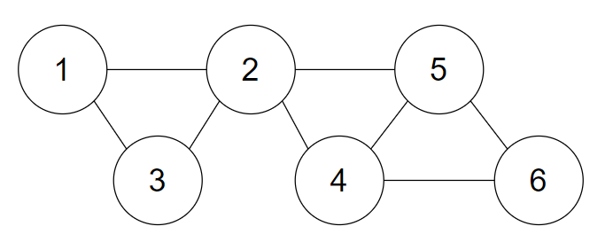

# Cliques-BK-algorithm
Algorithm to enumerate maximal cliques of a graph.

The Bron-Kerbosch algorithm is a recursive algorithm that uses three arrays.
- The array C contains the nodes that are being checked for cliques.
- The array V contains the nodes adjacent to the nodes of C that have not yet been processed.
- The array I contains the invalid nodes, that is, they have already been processed.

First we start with the empty arrays C and I, and V with all the nodes. Then an exhaustive check of all nodes and their neighbors is then performed to detect maximal cliques.

## Files
- *maximal_cliques.py*: functions needed.
- *test.py*: example of aplication. Run `python test.py`.

## Example
**Input**: graph represented as a dictcionary (key: nodes, value: list of adjacent nodes).

Undirected graph: G = {1:[2,3],2:[1,3,5],3:[1,2],4:[5,6],5:[2,4,6],6:[4,5]}

In this example maximal cliques are {1,2,3}, {2,5} and {4,5,6}.
